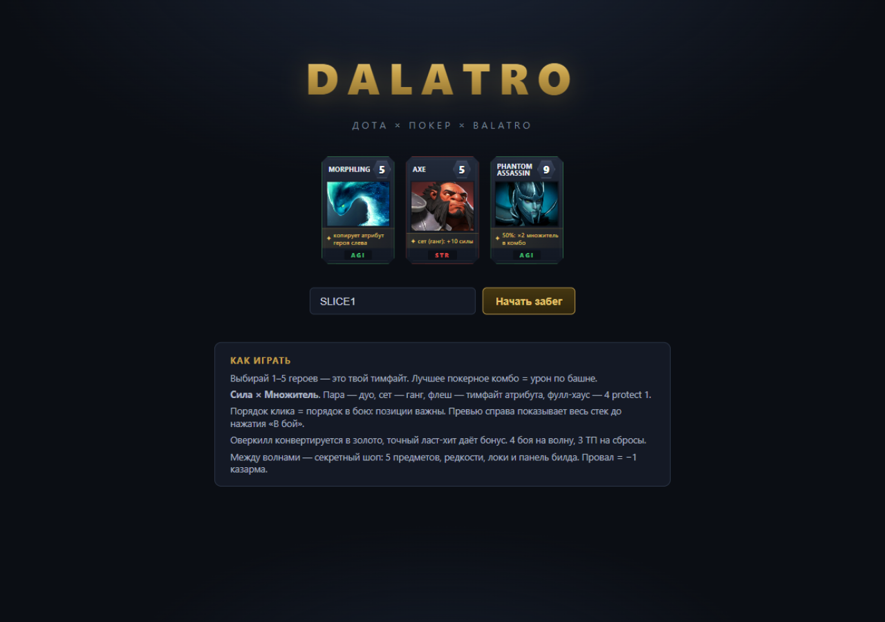
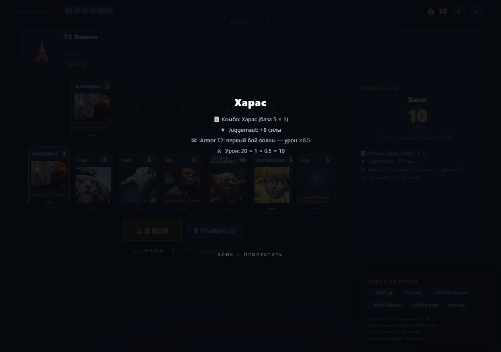
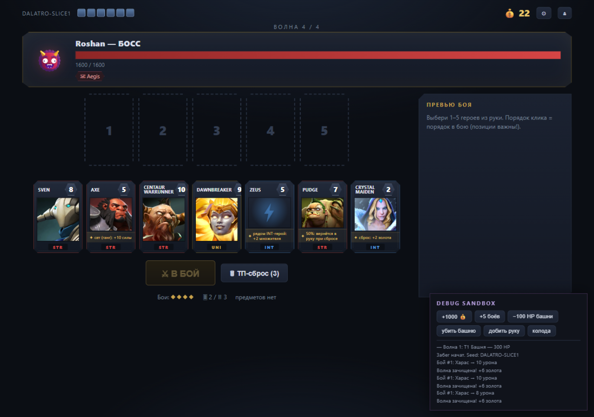
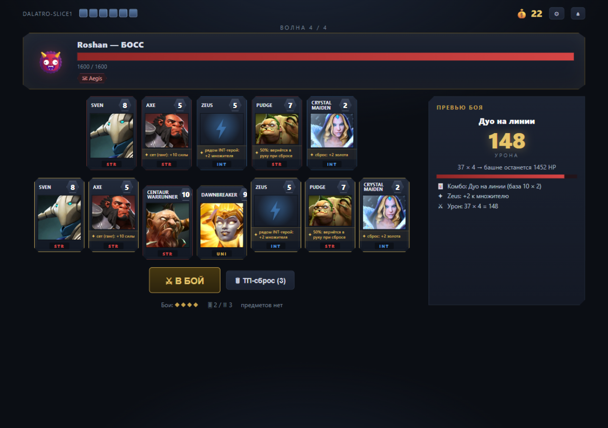
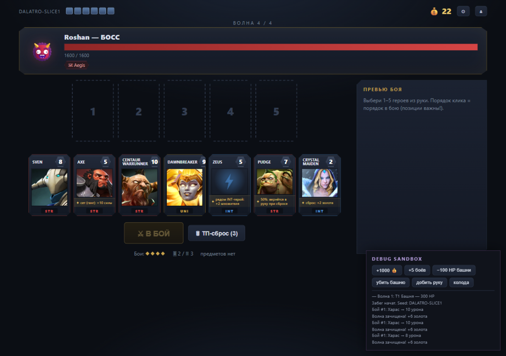
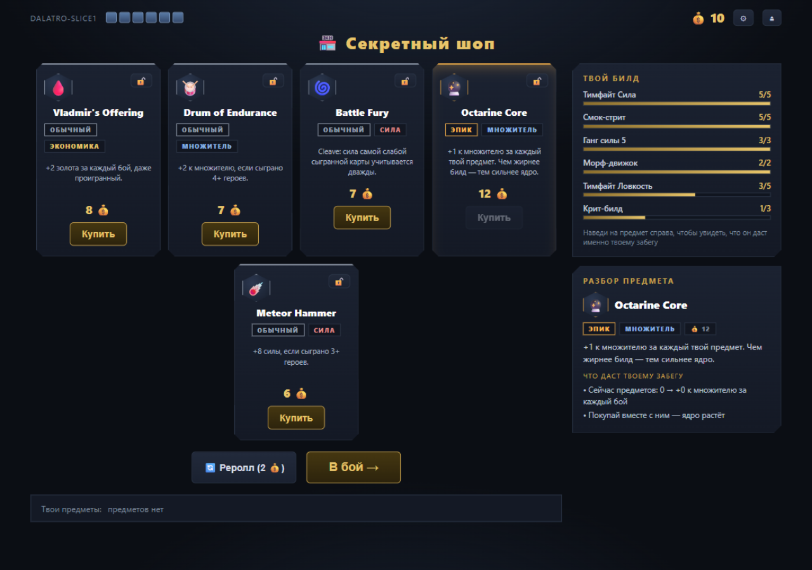

# DALATRO — GAME SPEC

Источник истины по игре. Для каждой механики: **зачем / правило игрока /
точное правило / взаимодействия / UI / edge cases**. Кодовые ссылки ведут в
`src/`. Статус: ✅ в слайсе · 🚧 частично · ⬜ roadmap.

---

## 1. Game Overview

Dota × покер × Balatro. Однокомпьютерный браузерный рогалик: из карты героев
собирается «команда» (1–5 героев), лучшее покерное комбо становится тимфайтом,
урон бьёт по башне врага. Между волнами — секретный шоп, который превращает
колоду героев в сломанный билд. Один забег = 30–60 минут, seed-детерминирован.



## 2. Design Pillars

1. **Сила × Множитель** — две оси роста; предметы качают разные оси и
   перемножаются.
2. **Механики простые, взаимодействия сложные** — каждая система читается за
   секунду; глубина рождается на пересечениях.
3. **Магазин — главный decision point** — «3 хорошие вещи, выбрать билд», а не
   «купить самую большую цифру».
4. **Никогда не наказывать за большой урон** — риск (Rapier) даёт драму,
   оверкилл всегда конвертируется в золото.
5. **Движок не знает героев** — контент это данные: триггеры/условия/эффекты.

## 3. Core Gameplay Loop ✅

`Волна (4 боя) → золото → шоп → следующая волна → … → Roshan → победа`

Бой: `рука 7 карт → выбрать 1–5 (порядок = позиции) → превью стека → Fight →
анимация разрешения → сброс сыгранных → добор до 7`.

## 4. Win / Lose Conditions ✅

- **Win:** убить Roshan (последняя волна акта 1).
- **Lose:** провалить волну при 0 казарм. Провал волны = −1 казарма, их 6.
- Провал не равен мгновенному проигрышу: башня восстанавливается, бой
  перезапускается (см. §26), но Rapier уходит врагу (§29).

## 5. Run Structure ✅

Акт 1: T1 (300) → T2 (550, Armor) → T3 (800, Glyph) → Roshan (1600, Aegis).
После каждой волны шоп. Полная структура актов 2–4 — ROADMAP.md.

## 6. Card System ✅

Карта = герой. Полная сетка **10 рангов (2–11) × 4 атрибута = 40 карт**;
в стартовой колоде 12 (`inDeck: true` в `content/heroes.js`), остальные ждут
рекрутмента. Карта несёт: силу (ранг), атрибут, способность (опционально).

## 7. Hero System ✅

Герой = данные + до одной способности. Способность — триггер
(`event/when/chance/effects`). Текущие 7 способностей учат разным системам:
комбо-триггер (Axe), позиции (Morphling, Juggernaut), атрибутная синергия
(Zeus), крит (PA), экономика сброса (CM, Pudge).

## 8. Attributes ✅

`str / agi / int / uni` — масти покера. Цвета: красный/зелёный/синий/золотой.
Атрибуты нужны для флеша и атрибутных условий (`EXISTS_ATTRIBUTE`), а также
для копирования (Morphling, иллюзии).

## 9. Ranks ✅

Сила 2–11. Ранг определяет пары/сеты/стриты. Aegis-ранг (11) — самый сильный.
«Детекционный ранг» (`detectPower`) может отличаться от силы: wild-эффекты
(Butterfly, Shadow Blade) и иллюзии (Manta) меняют его только для покера,
сила в уроне считается реальная.

## 10. Poker Combinations ✅

Таблица (`content/world.js`): хай-карта «Харас» 5×1 · пара «Дуо на линии»
10×2 · две пары «Ротация» 20×2 · сет «Ганг» 30×3 · стрит «Смок на Рошана»
30×4 · флеш «Тимфайт атрибута» 35×4 · фулл-хаус «4 protect 1» 40×6.
Детектор берёт **лучшее комбо, содержащееся в сыгранных картах**; все
сыгранные карты добавляют силу. Каре пока скорится как сет, стрит-флеш —
как флеш (расширение таблицы в ROADMAP).

## 11. Power / Multiplier Mathematics ✅

```
damage = round( power × mult × finalMult × towerMult )
power  = combo.basePower + Σ сил сыгранных (иллюзия — половина)
mult   = combo.baseMult + герои + предметы
```
Порядок срабатывания фиксирован (§12); `ADD_MULT` героев применяется до
`MULT_MULT` предметов — осознанный баланс (предметы усиливают героев).

## 12. Resolution Engine ✅

Порядок (единственный источник — `systems/combat.js`, продублирован в
ARCHITECTURE.md): PRE_DETECT → детекция → база → герои (по слотам) →
предметы (по покупке) → Refresher-повтор героев → модификаторы башни →
урон → смерть/Aegis → золото. Каждый шаг пишется в resolution stack
(`resolver.js`) — один объект для расчёта, превью, анимации и дебага.



## 13. Trigger System ✅

Формат: `{ event, when?, chance?, effects[] }` — один для героев, предметов
и модификаторов. События: `PRE_DETECT, ON_PLAY, COMBO_DETECTED,
FIGHT_SCORING, ON_DISCARD, ON_DEATH`. `chance` крутится seeded-RNG'ем;
в превью шанс не разыгрывается, а показывается строкой «🎲 шанс N%».

## 14. Effect System ✅

`engine/effects.js`: `ADD_POWER, ADD_MULT, MULT_MULT, FINAL_MULT, GOLD,
WEAKEST_POWER_DOUBLE, ADD_POWER_PER_PLAYED, ADD_MULT_PER_ITEM,
OVERKILL_RATE, REFRESH_HERO_TRIGGERS, IGNORE_TOWER_MODS, REVIVE,
RETURN_TO_HAND` + PRE_DETECT-семейство (`COPY_ATTRIBUTE, CREATE_ILLUSION,
WILD_RANK, BUMP_STRONGEST_RANK`), которое интерпретирует детекционный
пайплайн. Контент never mutates state — только объявляет эффекты.

## 15. Condition System ✅

`engine/conditions.js`: `COMBO_IS, COMBO_MIN, SLOT_IS,
PLAYED_COUNT_ABOVE, POWER_ABOVE, HAS_ITEM, TAG_IS, EXISTS_ATTRIBUTE` +
комбинаторы `all/any/not`. `EXISTS_ATTRIBUTE` исключает саму карту по ссылке —
поэтому Morphling, скопировавший INT, включает Zeus'а.

## 16. Position System ✅

Порядок клика = слоты 1–5. Влияет на: COPY_ATTRIBUTE (сосед слева),
SLOT_IS (Juggernaut в слоте 1), будущиеMagnus/Io-эффекты. Слоты показываются
над рукой; превью пересчитывается на каждый клик.

## 17. Deck / Hand / Discard ✅

Колода 12, рука 7, добор до полной руки; пустая колода пересобирает сброс.
Сыгранные уходят в сброс и возвращаются только после полного цикла — это
убирает спам идеальной рукой (регрессия покрыта тестом). 3 ТП-сброса на
волну: сброс выбранных карт + добор; Pudge может «зацепиться» и остаться.

## 18. Shop ✅ (v2)


- **5 предложений** одновременно, форма `{ id, locked }`.
- **Редкости:** common 62% / rare 28% / epic 10% за слот; борта и чипы
  окрашены; эпик-предметы меняют правила, а не цифры.
- **Категории:** Сила / Множитель / Правила / Экономика.
- **Lock:** 🔒 фиксирует предложение при реролле (реролл 2g).
- **Sell:** 50% стоимости, только в шопе.
- **Цены:** common 6–8, rare 8–11, epic 12–13.
- Цель — «конфликт желаний»: 5 привлекательных карт + реролл + лок +
  ограниченное золото.

## 19. Items ✅ (17)

Полный список с эффектами — CONTENT.md. Десятка слайса дополнена:
Heart (+25 силы), Satanic (×1.5 на паре/двух парах), Shadow Blade (±1 ранг
сильнейшей для комбо), Meteor Hammer (+8 при 3+ героях), Vladmir's (+2g/бой),
Radiance (+3 силы за героя), Octarine Core (+1 множителя за предмет).

## 20. Item Rarities ✅

common (серый) → rare (синий) → epic (золотой). Редкость = вес генерации +
цена + эмоциональный вес: эпик либо ломает правило (Rapier), либо строит
ось билда (Radiance, Octarine).

## 21. Economy ✅

Источники: зачистка волны +6, оверкилл (§24), ласт-хит +5, Vladmir's.
Стоки: предметы, реролл. Продажа возвращает 50%. Плюс золото за точность
делает «бить точно» осмысленной стратегией.

## 22. Gold ✅

Старт 4. Отображение в хедере; превью боя показывает `+N 💰` за
оверкилл/ласт-хит **до** коммита.

## 23. Last Hit ✅

Урон ровно в HP башни → +5 золота. Требует решимости сыграть слабую руку —
контрапункт «бей на максимум».

## 24. Overkill ✅

Оверкилл = урон − HP башни. Курс: первые 50% maxHp — 1g/20, дальше 1g/40
(затухание; ×2 с Midas). Никогда не штрафуем мощь — награждаем точность.

## 25. Towers ✅

T1/T2/T3 с HP и модификаторами-правилами (§27). Башня = босс с тем же
форматом `modifiers: []` — новая волна это данные.

## 26. Barracks ✅

6 казарм = жизни забега; провал волны −1; 0 = трон пал (game over).
После провала: башня восстанавливается, бои/ТП обнуляются, колода
пересобирается, Rapier уходит врагу.

## 27. Bosses ✅ / ⬜

Слайс: Roshan с **Aegis** (один раз возрождается на 50% HP) — доказывает,
что модификаторы расширяемы. Tinker/Enigma/Invoker/Techies/Midas с их
контрпредметами — ROADMAP (принцип: босс создаёт проблему, шоп продаёт ответ).



## 28. Roshan / Aegis ✅

Aegis = триггер `ON_DEATH → REVIVE 50%` на модификаторе башни. После
возрождения бейдж перечёркивается (`aegisUsed`), смерть финальна.

## 29. Divine Rapier ✅

×2 к итоговому урону. Провал волны: рапира переходит башне
(`enemyItems`), весь твой урон по ней ×0.5, бейдж в зоне башни. Зачистка
вернёт рапиру. Проверено тестом «провал → враг → возврат».

## 30. RNG / Seeds ✅

mulberry32 + seed-код (`DALATRO-SLICE1`). RNG живёт вне state
(`Rng.current()`); счётчик дриплов сохраняется вместе с забегом —
восстановление перематывает стрим точно. `Rng.suppress` (превью) возвращает
константу без расхода стрима. Сид-шаринг: тот же сид + те же действия =
тот же забег.

## 31. Preview System ✅

`Sim.simulate(state, CONFIRM_FIGHT)` = `structuredClone` + подавленный RNG +
тот же dispatch. Ноль отдельной preview-логики. Показывает: комбо, силу ×
множитель, урон, HP башни после, золото, полный стек шагов, 🎲-лотереи и
🔗-цепочки — когда способность сработала только благодаря копии атрибута
(Morphling открыл условие Zeus), стек это объясняет явно.



## 32. Combat Replay ✅

Анимация боя проигрывает тот же resolution stack шаг за шагом (300 мс/шаг),
финальное число — с «панч»-анимацией. Клик пропускает.

## 33. Sandbox ✅

Debug-панель (⚙ или клавиша D): +1000 золота, +5 боёв, −100 HP, убить башню,
добить руку, показать колоду, лог событий. `window.__dalatro` из консоли —
state/Game/Sim/Advisor.



## 34. UI Architecture ✅

State → Render: `ui.js` никогда не источник данных; события — делегирование
`data-action`. Экраны: title / wave / shop / victory / gameover. Все панели —
`clip-path`-грани в стиле Dota UI.

## 35. Visual Direction ✅

Balatro readability × Dota visual language × roguelike-панели. Подробности и
IP-политика — VISUAL_SPEC.md.

## 36. Typography ✅

Системный Segoe UI/system-ui; цифры урона 44–88px bold с золотым свечением;
заголовки панелей — caps + letter-spacing; названия карт — 9.5px caps,
переносятся на 2 строки.

## 37. Colors ✅

Палитра в `styles.css` `:root`: фон #0b0e14, панели #141925/#1b2231, золото
#c8a24b/#e8c56a, атрибуты str #d64545 / agi #3fb96b / int #4a90d9 /
uni #c8a24b, редкости common #98a2b3 / rare #4fa3ff / epic #ffb84d.

## 38. Cards ✅

Анатомия v2 (минимализм): портрет во всю карту → верхний оверлей (гем силы,
окрашенный атрибутом + метка ✦ у героев со способностями) → нижняя плашка
имени. **Атрибут = цвет рамки/гема, без текста** — пять карт одного цвета
читаются как флеш. Назначение атрибута объясняется в тултипе карты и в
«как играть». Иконки предметов — CDN Valve с эмодзи-фолбэком
(§35, VISUAL_SPEC.md). Гранёные углы `clip-path`. Выбранная карта
поднимается на 16px и золотится.

## 39. Shop UI ✅

Сетка 5 предложений + правая колонка: **ТВОЙ БИЛД** (прогресс синергий из
твоей колоды: флеш-линии, стрит, ганги, крит-билд, морф-движок, кузня
рангов) и **ЛУПА/РАЗБОР ПРЕДМЕТА** (правила + «что даст твоему забегу»:
Manta видит пары в колоде, BKB знает модификатор следующей башни, Octarine
считает твои предметы). Hover или клик пиннят предмет.



## 40. Animations ✅

Только осмысленные: появление шагов стека (slide-in), панч урона (scale
cubic-bezier), подьём выбранной карты, шейк — отсутствует (нужен звук).
Никаких бесконечных анимаций — они мешают чтению стека.

## 41. Audio Direction ⬜

Рогатые «дота-звуки» при комбо, крит «шинг», рошан-рёв. Слой звук
закладывается: события уже централизованы (resolution steps = точки звука).

## 42. Accessibility 🚧

Tooltips на всём (title-атрибуты), клавиша D, никаких таймеров. Нужны:
hotkeys выбора карт, фокус с клавиатуры, контраст редкостных чипов.

## 43. Content Schema ✅

Герой: `{ id, name, attr, power, inDeck, emoji?, ability? }`.
Предмет: `{ id, name, cost, emoji, rarity, category, desc, ability }`.
Волна: `{ id, name, emoji, hp, isBoss?, modifiers: [{id}] }`.
Модификатор: `{ id, name, desc, hpPercent?, ability? }`.
Комбо: `{ id, name, basePower, baseMult, rank }`. Полные таблицы — CONTENT.md.

## 44. File Structure ✅

```
src/engine/   game, actions(dispatch), events, conditions, effects,
              triggers, resolver, simulator
src/systems/  rng, poker, deck, combat, economy, advisor
src/content/  heroes, items, world(волны+модификаторы+комбо), content(реестр)
src/ui/       art(портреты+сигилы), ui(рендер), styles.css
tests/        node-vm раннер + 37 тестов
build.js / serve.js / index.html / dist/index.html
```

## 45–47. Event / Effect / Modifier Catalogs ✅

Полные перечни: §13 (события), §14 (эффекты), §25–28 + `content/world.js`
(модификаторы: Armor, Glyph, Aegis). Каждый каталог закрыт тестами
(`tests/`).

## 48. Current Content ✅

12 героев в колоде (7 с абилками) + 28 в ростере · 17 предметов ·
4 волны · 6 комбо + хай-карта · 7 билд-направлений советчика. Таблицы:
CONTENT.md.

## 49. Future Content ⬜

Ростер 40 → рекрутмент героев в шопе · 5 боссов акта 2 · роли/теги ·
статусы · Aghanim · греййярд-герои · neutral items · curses — ROADMAP.md.

## 50. Known Limitations 🚧

- Каре/стрит-флеш скорятся как сет/флеш (детекция готова, таблица нет).
- Butterfly-уклонение и BKB захардкожены в фазе tower mods.
- Shadow Blade почти всегда no-op в стартовой колоде — раскрывается с
  дубликатами рангов (Arcana).
- Баланс волн не откалиброван по живым забегам (см. BALANCE.md).
- ПрофитABILITY иллюзий в детекции покера проверена тестами, но не UX.

## 51. Testing Strategy ✅

`npm test`: node-vm грузит те же скрипты, что браузер, в том же порядке;
37 тестов: покер, детекционные хуки, математика, позиции, Refresher,
Armor/BKB, Glyph, Aegis, ласт-хит, оверкилл, Rapier-цикл, цикл колоды,
магазин/лок/редкости, советчик, регрессии (state.rng, мгновенный возврат
карт). Новая механика = тест до мерджа.

## 52. Balance Philosophy ✅

Две оси растут мультипликативно — числа калибруются волнами: базовый билд
проходит акт с 1–2 потерянными казармами; эпики должны ощущаться как «игра
сломалась». Ручки: HP волн, база комбо, курсы золота, веса редкостей
(все — в BALANCE.md).

## 53. Design Anti-Goals

- Никаких таймеров/энергии/дейли-мутаций.
- Никакой кнопки «авто-лучший ход» — стек читаем, решения игрок принимает сам.
- Не наказывать за оверкилл и мощь; риск только через добровольный
  tradeoff (Rapier, curses).
- Не добавлять механику, у которой нет обеих половин (источник + получатель).

## 54. Roadmap ⬜

Frozen backlog — ROADMAP.md. Следующий шаг после слайса: тест «на друзьях»
(покупают ли предметы ради синергии), затем акт 2.
