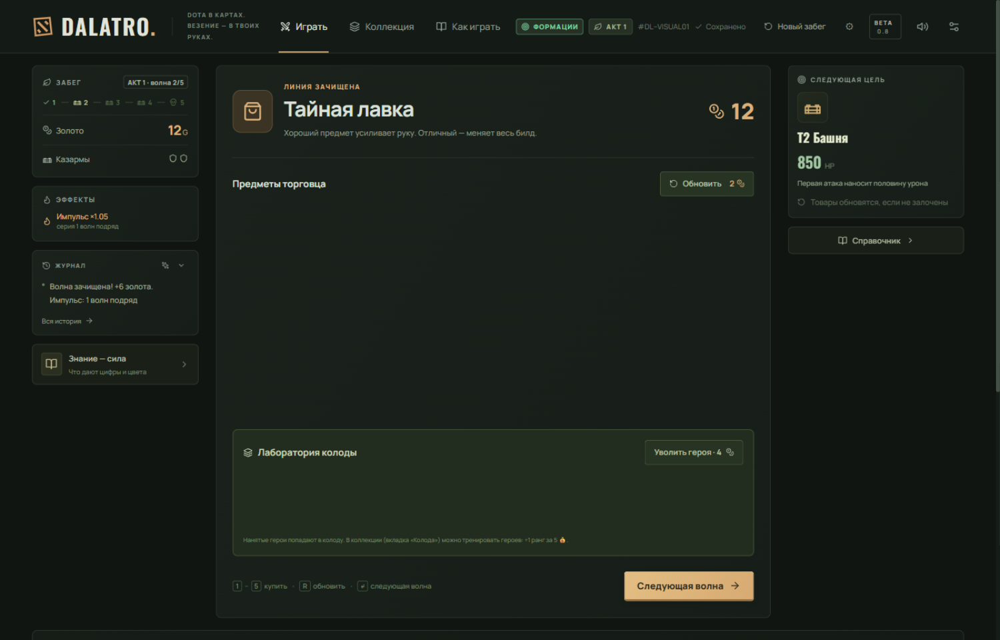

# dotora — Dota × покер × Balatro

Браузерный рогалик: собираешь тимфайт из героев как покерную комбинацию,
**Сила × Множитель** бьёт по башне врага. v0.4 — развилки маршрутов
(элитки с проклятиями, крип-лагерь), таверна: найм/увольнение/тренировка
героев, 24 способности ростера, UI «на линии», онбординг, ставка и импульс.



## Запуск

**Вариант 1 — двойной клик:** открыть `dist/index.html` — вся игра одним
файлом (фон `dist/images/battlefield.jpg` рядом), работает без сервера
(портреты подгружаются с CDN Valve, офлайн включаются SVG-сигилы).

**Вариант 2 — разработка:** Docker не нужен вообще — только чистый Node.

```bash
node serve.js     # http://localhost:8000 — только статика
node server.js    # http://localhost:8787 — статика + API + админка
npm test          # 428 тестов (движок + бэкенд)
npm run build     # пересборка dist/index.html
```

Ноль зависимостей. React-прототип в `test/` — только референс UI, в сборку
не входит.

**Вариант 3 — с аккаунтами и онлайн-таблицей лидеров:**

```bash
npm start         # node server.js → http://localhost:8787
```

Тот же сервер раздаёт игру и принимает API: аккаунты (имя + пароль),
автосинхронизация забегов в конце каждого, онлайн-топы (счёт, лестница
рангов, быстрые победы, чистые забеги) и профили. Счёт пересчитывается на
сервере по формуле движка — подменить очки с клиента нельзя. Забег без
аккаунта тоже попадает в таблицу (как «Гость #XXXX»), а регистрация
забирает гостевые забеги в аккаунт. Без сервера
игра полностью работает оффлайн: прогресс в localStorage, «Зал славы» —
локальный. Данные сервера лежат в `data/` (в git не входят).

**Админка и аналитика:** `http://localhost:8787/admin` — трафик по часам
(просмотры, API-запросы, посетители, латентность, доли ошибок), регистрации
и забеги по дням, топы путей и IP, таблица игроков, живой хвост запросов и
журнал событий. При первом запуске пароль генерируется и печатается в
консоль (хранится в `data/admin.json`); свой — `DOTORA_ADMIN_PASSWORD` при
первом запуске.

**Прод:** [https://dotora.ru](https://dotora.ru) — Selectel VDS рядом с
logITika/opinia, Docker, порт 8891 на loopback, nginx + certbot на хосте.
Полный ранбук — [deploy/DEPLOY.md](deploy/DEPLOY.md).

## Как играть

1. Выбери 1–7 героев из руки (до 5 в бой) — **порядок клика = порядок в
   бою**. Ранг (цифра) даёт силу и собирает комбо, цвет (атрибут) собирает
   флеш, способности читают позиции и соседей.
2. Комбинации и их названия всегда справа: подсвечивается собранная тобой
   и те, что уже собираются из руки. Клик по названию комбо — полный
   расчёт урона шаг за шагом до удара.
3. **Ставка**: 1 герой = харас (+1💰), 4 = ×1.1, 5 = ×1.25. **Импульс**:
   серия зачищенных волн даёт +5% урона за волну, провал сбрасывает.
4. 4 тимфайта и 3 сброса на волну, 2 казармы (жизни забега). Оверкилл → золото,
   ласт-хит +5. Первый запуск — подсказки в одну строку в момент действия:
   билд → враг → рука → способность в превью → тимфайты и сброс после
   боя; дальше — записки «первый раз в лавке/на развилке». «Как играть» —
   всегда под рукой.
5. Шоп между волнами: 5 предметов, редкости, локи, продажа, разбор «что
   даст твоему забегу» + **лаборатория колоды**: таверна нанимает героев,
   лишних можно уволить, а любимцев натренировать (+1 ранг). Techies
   минирует 2 карты руки — Sentry Ward или BKB решают.
6. **Развилка после лавки**: обычная башня, элитка (HP ×1.5 + проклятие,
   золото ×1.5 и эпик в лавке) или крип-лагерь (+6g, +1 казарма, бесплатное
   увольнение). BKB игнорирует проклятия. Перед Рошаном развилки нет.
7. Забег детерминирован сидом; автосейв в localStorage. Звук (WebAudio)
   и анимации — в настройках. Клавиши: `1–7` выбор, `Enter` бой, `R` сброс,
   `Esc`, `D` — песочница.

## Документация

| Документ | Что внутри |
|---|---|
| [GAME_SPEC.md](GAME_SPEC.md) | источник истины: все разделы по механикам |
| [ARCHITECTURE.md](ARCHITECTURE.md) | движок, порядок срабатывания, схема файлов |
| [CONTENT.md](CONTENT.md) | таблицы контента: герои, предметы, волны, комбо |
| [BALANCE.md](BALANCE.md) | экономика, HP волн, ручки калибровки |
| [VISUAL_SPEC.md](VISUAL_SPEC.md) | визуальный язык v3, онбординг, IP-политика |
| [ROADMAP.md](ROADMAP.md) | замороженный бэклог (акты 2–4) |
| [docs/DESIGN.md](docs/DESIGN.md) | дизайн-философия: почему механики устроены так |
| [docs/SYNERGIES.md](docs/SYNERGIES.md) | матрица взаимодействий и паттерны синергий |
| [docs/PROMPT.md](docs/PROMPT.md) | промпт LLM-генерации контента под схему движка |
| [docs/screenshots/](docs/screenshots) | паспорт UI (12 скриншотов) |
| [test/](test/) | React-прототип — визуальный референс v3 |

## Золотое правило

> **Контент никогда не мутирует GameState напрямую.** Контент декларирует
> условия и эффекты. Движок их разрешает. State меняет только движок.

Новый герой/предмет/босс = запись в `src/content/*.js`, ноль правок движка.
